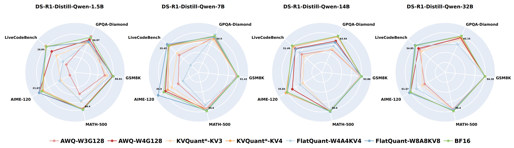

# npu上的代码适配
暂时只做了模型DeepSeek-R1-Distill-Qwen-7B的awq和flatquant方法的适配修改。

## 目录

- [环境配置](#环境配置)
- [代码使用](#代码使用)
- [量化方法说明](#量化方法说明)


## 环境配置
这是使用华为昇腾910B进行测试的npu适配版本，基于vllm_ascend镜像进行docker构建和环境配置。具体的环境配置如下：
```shell
cd /PATH/Quantized-Reasoning-Models
# 创建容器
bash docker_start.sh

# 进入容器后继续以下操作
# 相比于原版删除了transformers库和torch库的下载
# 镜像内transformers库的默认版本是4.53.3，torch库的默认版本是2.7.1+cpu，torch_npu库的默认版本是2.7.1.dev20250724
# 为适配vllm_ascend均不能修改
# 使用pip安装前，可能需要重新配置pip的镜像源
pip install -r requirements.txt
# 建议到源链接下载到镜像内目录后安装
pip install -e ./third-party/lighteval
pip install -e ./third-party/lighteval[math]
```

数据集和模型文件的配置请参考 ./datasets/readme.md。

## 代码使用
使用命令行运行，推荐使用后台挂载方式，以便退出容器和服务器时能够正常继续运行，并且可以随时查看npu的使用情况：
### 量化
```shell
# awq方法，需要修改参数请到对应的awq.sh文件
nohup bash scripts/quantization/awq.sh /PATH/DeepSeek-R1-Distill-Qwen-7B 4 0 > output_awq.log 2>&1 &
# flatquant方法，需要修改参数请到对应的flatquant.sh文件
nohup bash scripts/quantization/flatquant.sh /PATH/DeepSeek-R1-Distill-Qwen-7B 4 0 > output_flatquant.log 2>&1 &
```
量化后模型默认保存到 ./outputs/modelzoo/method_name/ 文件夹
### 评测
```shell
# 评测该代码库量化后的模型只需要更改模型读取路径，可以添加参数seed来改变随机数种子，默认seed=42
nohup bash scripts/inference/inference.sh /PATH/DeepSeek-R1-Distill-Qwen-7B 0,1,2,3 > output_test.log 2>&1 &
nohup bash scripts/inference/inference.sh ./outputs/modelzoo/flatquant/DeepSeek-R1-Distill-Qwen-7B-flatquant-w8a8kv8-tp4 0,1,2,3 > output_test.log 2>&1 &
# 添加随机数种子的示例
nohup bash scripts/inference/inference.sh /PATH/DeepSeek-R1-Distill-Qwen-7B 0,1,2,3 43 > output_test.log 2>&1 &
```
完成全部评测后可以将结果通过表格的形式进行打印，如果原模型文件没有存在项目目录中，请修改make_stats_table.py文件中line 90为：
```shell
# modelzoo_dir = "./modelzoo/QwQ" if "QwQ" in model else "./modelzoo/DeepSeek-R1"
modelzoo_dir = "root_path_to_your_model"
```

之后正常使用表格生成的代码：
```shell
python -m make_stats_table --stats acc --models DeepSeek-R1-Distill-Qwen-7B --methods "" --seeds 42        # 测试准确率
python -m make_stats_table --stats length --models DeepSeek-R1-Distill-Qwen-7B --methods "" --seeds 42     # 测试所需的推理长度
# 测试量化后自动保存的模型，示例如下
python -m make_stats_table --stats acc --models DeepSeek-R1-Distill-Qwen-7B --methods flatquant-w4a4kv4 --seeds 42 
```

评测结果会默认保存到 ./outputs/inference/ 文件夹下。

备注：对于FlatQuant模型，正常使用重参数化请注意注意模型的config文件中使用自定义的Qwen2FlatQuantForCausalLM类，不使用重参数化则模型的config文件中使用Qwen2ForCausalLM类。另外FlatQuant模型由于使用自定义类注册进vllm来进行评测，速度慢是正常的。速度慢和速度不稳定现象的原因尚待探明。
### 推理测试
用于检测模型能否完成简单的对话推理任务：
```shell
# 需要修改python文件中的模型读取路径
# 测试模型能否通过vllm_ascend库正常进行推理
python test1.py
# 测试模型能否通过transformers库正常进行推理
python test2.py
```
备注：正常使用FlatQuant方法量化后的模型，由于使用了重参数化，需要适配自定义的Qwen2FlatQuantForCausalLM类和相关的一系列自定义类，所以使用transformers库中的默认类进行推理，生成乱码是正常现象。如果FlatQuant方法中不进行重参数化，那么应该使用默认类进行推理来正常生成。

## 关于FlatQuant方法的修改说明
### 在FlatQuant方法中，如果需要不进行最后一层的量化，请按如下说明修改代码：
* ./methods/flatquant/flatquant/train_utils.py line 99:
  ```python
  for i in range(num_train_layer-1):
  ```
* ./methods/flatquant/flatquant/flat_utils.py line 34:
  ```python
  for idx in range(model.config.num_hidden_layers-1):
  ```
  line 86:
  ```python
  for i in range(len(model.model.layers)-1):
  ```
* ./methods/flatquant/flatquant/model_tools/qwen_utils.py line 359:
  ```python
  for layer in range(model.config.num_hidden_layers-1):
  ```
### 测试表明重参数化方法可能会显著影响量化后模型的推理效果和需要选用的class，具体原因还在研究，请按如下说明选择性使用：
* ./methods/flatquant/main.py line 50：
    ```python
    # 这里可以通过选择是否注释重参数化函数（源代码中使用）来探究性质
    flat_utils.reparameterize_model(model)
    ```

原代码库的Readme文件如下所示：
# Quantization Hurts Reasoning? An Empirical Study on Quantized Reasoning Models

[](https://arxiv.org/abs/2504.04823)

This repository contains the PyTorch implementation of "Quantization Hurts Reasoning? An Empirical Study on Quantized Reasoning Models".

We provide a systematic study on quantized reasoning models, evaluating the open-sourced DeepSeek-R1-Distilled Qwen and LLaMA families ranging from 1.5B to 70B parameters, and QwQ-32B. Our investigation covers weight, KV cache, and activation quantization using state-of-the-art algorithms at varying bit-widths, with extensive evaluation across various reasoning benchmarks. We hope our research provides valuable guidance toward better quantization methods for reasoning models in the research community.



## News 🔥

- [2025/07] Our paper has been accepted to COLM 2025! 🎉
- [2025/06] We now support real-quantization for AWQ and GPTQ. The real-quantized models are released at [Modelzoo](#modelzoo).
- [2025/04] The code for fake-quantization and evaluation is publicly released!

## Contents

- [Preparations](#preparations)
- [Model Quantization](#model-quantization)
- [Evaluation](#evaluation)
- [Visualization](#visualization)
- [Modelzoo](#modelzoo)
- [Acknowledgements](#acknowledgements)
- [References](#references)

## Preparations

### Installation

```bash
git clone https://github.com/ruikangliu/Quantized-Reasoning-Models.git
cd Quantized-Reasoning-Models
git submodule update --init --recursive

conda create -n quantized-reasoning-models python=3.12 -y
conda activate quantized-reasoning-models
pip install -r requirements.txt
pip install -e ./third-party/fast-hadamard-transform
VLLM_USE_PRECOMPILED=1 pip install -e ./third-party/vllm
pip install -e ./third-party/lighteval
pip install -e ./third-party/lighteval[math]
pip uninstall xformers -y && pip install -v -U -e third-party/xformers

# Real-quantization (optional)
# Quantize model with AutoAWQ
pip install -e ./third-party/AutoAWQ
# Quantize model with GPTQModel
pip install -v -e ./third-party/GPTQModel --no-build-isolation
# Quantize model with llm-compressor
# pip install -e ./third-party/llm-compressor
```

### Data Preparation

Download datasets in `./datasets`.

**Calibration Set**

| Dataset   | Local Dir                  | URL                                                                                                                     |
| --------- | -------------------------- | ----------------------------------------------------------------------------------------------------------------------- |
| WikiText2 | `./datasets/wikitext`        | [https://huggingface.co/datasets/wikitext](https://huggingface.co/datasets/wikitext)                                       |
| Pile      | `./datasets/pile-val-backup` | [https://huggingface.co/datasets/mit-han-lab/pile-val-backup](https://huggingface.co/datasets/mit-han-lab/pile-val-backup) |
| NuminaMath-1.5      | `./datasets/NuminaMath-1.5` | [https://huggingface.co/datasets/AI-MO/NuminaMath-1.5](https://huggingface.co/datasets/AI-MO/NuminaMath-1.5) |

**Evaluation Benchmarks**

| Dataset   | Local Dir                  | URL                                                                                                                     |
| --------- | -------------------------- | ----------------------------------------------------------------------------------------------------------------------- |
| AIME-90 | `./datasets/AIME90`        | [https://huggingface.co/datasets/xiaoyuanliu/AIME90](https://huggingface.co/datasets/xiaoyuanliu/AIME90)                                       |
| AIME-2025        | `./datasets/aime_2025`      | [https://huggingface.co/datasets/yentinglin/aime_2025](https://huggingface.co/datasets/yentinglin/aime_2025)                                   |
| MATH-500      | `./datasets/MATH-500` | [https://huggingface.co/datasets/HuggingFaceH4/MATH-500](https://huggingface.co/datasets/HuggingFaceH4/MATH-500) |
| GSM8K      | `./datasets/gsm8k` | [https://huggingface.co/datasets/openai/gsm8k](https://huggingface.co/datasets/openai/gsm8k) |
| GPQA-Diamond      | `./datasets/gpqa` | [https://huggingface.co/datasets/Idavidrein/gpqa](https://huggingface.co/datasets/Idavidrein/gpqa) |
| LiveCodeBench      | `./datasets/code_generation_lite` | [https://huggingface.co/datasets/livecodebench/code_generation_lite](https://huggingface.co/datasets/livecodebench/code_generation_lite) |

> AIME-120 is composed of two datasets: AIME-90 and AIME-2025.

**Generate Reasoning Calibration Set from NuminaMath-1.5**

We use self-generated reasoning data for GPTQ calibration.


```bash
# Generate calibration data for DeepSeek-R1-Distill-Qwen-7B on devices 0,1,2,3
bash scripts/data/gen_calib.sh ./modelzoo/DeepSeek-R1/DeepSeek-R1-Distill-Qwen-7B 0,1,2,3
```

### Model Preparation

Download models in `./modelzoo`.

| Model   | Local Dir                  | URL                                                                                                                     |
| --------- | -------------------------- | ----------------------------------------------------------------------------------------------------------------------- |
| DeepSeek-R1-Distill-Qwen-1.5B | `./modelzoo/DeepSeek-R1/DeepSeek-R1-Distill-Qwen-1.5B`        | [https://huggingface.co/deepseek-ai/DeepSeek-R1-Distill-Qwen-1.5B](https://huggingface.co/deepseek-ai/DeepSeek-R1-Distill-Qwen-1.5B)                                       |
| DeepSeek-R1-Distill-Qwen-7B | `./modelzoo/DeepSeek-R1/DeepSeek-R1-Distill-Qwen-7B`        | [https://huggingface.co/deepseek-ai/DeepSeek-R1-Distill-Qwen-7B](https://huggingface.co/deepseek-ai/DeepSeek-R1-Distill-Qwen-7B)                                       |
| DeepSeek-R1-Distill-Qwen-14B | `./modelzoo/DeepSeek-R1/DeepSeek-R1-Distill-Qwen-14B`        | [https://huggingface.co/deepseek-ai/DeepSeek-R1-Distill-Qwen-14B](https://huggingface.co/deepseek-ai/DeepSeek-R1-Distill-Qwen-14B)                                       |
| DeepSeek-R1-Distill-Qwen-32B | `./modelzoo/DeepSeek-R1/DeepSeek-R1-Distill-Qwen-32B`        | [https://huggingface.co/deepseek-ai/DeepSeek-R1-Distill-Qwen-32B](https://huggingface.co/deepseek-ai/DeepSeek-R1-Distill-Qwen-32B)                                       |
| DeepSeek-R1-Distill-Llama-8B | `./modelzoo/DeepSeek-R1/DeepSeek-R1-Distill-Llama-8B`        | [https://huggingface.co/deepseek-ai/DeepSeek-R1-Distill-Llama-8B](https://huggingface.co/deepseek-ai/DeepSeek-R1-Distill-Llama-8B)                                       |
| DeepSeek-R1-Distill-Llama-70B | `./modelzoo/DeepSeek-R1/DeepSeek-R1-Distill-Llama-70B`        | [https://huggingface.co/deepseek-ai/DeepSeek-R1-Distill-Llama-70B](https://huggingface.co/deepseek-ai/DeepSeek-R1-Distill-Llama-70B)                                       |
| QwQ-32B | `./modelzoo/QwQ/QwQ-32B`        | [https://huggingface.co/Qwen/QwQ-32B](https://huggingface.co/Qwen/QwQ-32B)                                       |


## Model Quantization

### Fake Quantization

In quantization, we need to specify the Tensor Parallelism number (TP) during model inference. TP is typically set to 4 or 8.

The fake-quantized models will be saved in `outputs/modelzoo`.

**AWQ (W3A16KV16 & W4A16KV16)**

```bash
# Quantize DeepSeek-R1-Distill-Qwen-7B with AWQ on device 0. TP is set to 4.
bash scripts/quantization/awq.sh ./modelzoo/DeepSeek-R1/DeepSeek-R1-Distill-Qwen-7B 4 0
```

**GPTQ (W3A16KV16 & W4A16KV16)**

```bash
# Quantize DeepSeek-R1-Distill-Qwen-7B with GPTQ on device 0. TP is set to 4.
bash scripts/quantization/gptq.sh ./modelzoo/DeepSeek-R1/DeepSeek-R1-Distill-Qwen-7B 4 0
```

**KVQuant\* (W16A16KV3 & W16A16KV4)**

```bash
# Quantize DeepSeek-R1-Distill-Qwen-7B with KVQuant* on device 0. TP is set to 4.
bash scripts/quantization/kvquant_star.sh ./modelzoo/DeepSeek-R1/DeepSeek-R1-Distill-Qwen-7B 4 0
```

**QuaRot-KV (W16A16KV3 & W16A16KV4)**

```bash
# Quantize DeepSeek-R1-Distill-Qwen-7B with QuaRot-KV on device 0. TP is set to 4.
bash scripts/quantization/quarot_kv.sh ./modelzoo/DeepSeek-R1/DeepSeek-R1-Distill-Qwen-7B 4 0
```

**SmoothQuant (W8A8KV8)**

```bash
# Quantize DeepSeek-R1-Distill-Qwen-7B with SmoothQuant on device 0. TP is set to 4.
bash scripts/quantization/smoothquant.sh ./modelzoo/DeepSeek-R1/DeepSeek-R1-Distill-Qwen-7B 4 0
```

**QuaRot (W4A4KV4, W8A8KV8)**

```bash
# Quantize DeepSeek-R1-Distill-Qwen-7B with QuaRot on device 0. TP is set to 4.
bash scripts/quantization/quarot.sh ./modelzoo/DeepSeek-R1/DeepSeek-R1-Distill-Qwen-7B 4 0
```

**FlatQuant (W4A4KV4, W8A8KV8)**

```bash
# Quantize DeepSeek-R1-Distill-Qwen-7B with FlatQuant on device 0. TP is set to 4.
bash scripts/quantization/flatquant.sh ./modelzoo/DeepSeek-R1/DeepSeek-R1-Distill-Qwen-7B 4 0
```

### Real Quantization

Currently, we provide real-quantization scripts for AWQ and GPTQ INT4-quantized models.

**AWQ (W4A16KV16)**

```bash
# Quantize DeepSeek-R1-Distill-Qwen-7B with AWQ on device 0.
bash scripts/real_quantization/awq.sh ./modelzoo/DeepSeek-R1/DeepSeek-R1-Distill-Qwen-7B 0
```

**GPTQ (W4A16KV16)**

```bash
# Quantize DeepSeek-R1-Distill-Qwen-7B with GPTQ on device 0.
bash scripts/real_quantization/gptq.sh ./modelzoo/DeepSeek-R1/DeepSeek-R1-Distill-Qwen-7B 0
```

## Evaluation

**Inference with Quantized Models**

The number of devices used in inference should be consistent with the TP number specified in quantization.

By default, we use three different seeds for evaluation. The inference results will be saved in `outputs/inference`.

```bash
# Run inference of DeepSeek-R1-Distill-Qwen-7B model on devices 0,1,2,3
bash scripts/inference/inference.sh ./modelzoo/DeepSeek-R1/DeepSeek-R1-Distill-Qwen-7B 0,1,2,3

# Run inference of GPTQ-fake-quantized DeepSeek-R1-Distill-Qwen-7B model on devices 0,1,2,3
bash scripts/inference/inference.sh ./outputs/modelzoo/gptq/DeepSeek-R1-Distill-Qwen-7B-gptq-w4g128-tp4 0,1,2,3

# Run inference of GPTQ-real-quantized DeepSeek-R1-Distill-Qwen-7B model on devices 0,1,2,3
bash scripts/inference/inference.sh ./outputs/modelzoo/real_quantization/gptq-gptqmodel/DeepSeek-R1-Distill-Qwen-7B-quantized.gptq-gptqmodel-w4g128 0,1,2,3
```

**Show evaluation results**

```bash
# Print accuracy results
python -m make_stats_table --stats acc

# Print response length results (number of reasoning steps)
python -m make_stats_table --stats length
```

To show evaluation results of real-quantized models, specify `--methods quantized.gptq-gptqmodel-w4g128 quantized.awq-autoawq-w4g128`

## Visualization

```bash
# Visualize the dataset domain gap (Figure 8 & 9)
python -m methods.visualize.visualize --model ./modelzoo/DeepSeek-R1/DeepSeek-R1-Distill-Qwen-1.5B --exp dataset-domain-gap

# Visualize the bias term in K cache (Figure 10 & 11)
python -m methods.visualize.visualize --model ./modelzoo/DeepSeek-R1/DeepSeek-R1-Distill-Qwen-1.5B --exp kcache-bias
```

## Modelzoo

We provide the real-quantized reasoning models at [HuggingFace](https://huggingface.co/collections/ruikangliu/deepseek-r1-distill-quantized-68357b2a87b1a76137ad20d0). The supported models are listed in the following table:

| Model             | AWQ-W4G128   | GPTQ-W4G128   |
| ----------------- | ---------------- | --------- |
| DeepSeek-R1-Distill-Qwen | ✅ 1.5B / 7B / 14B / 32B | ✅ 1.5B / 7B / 14B / 32B |

## Acknowledgements

This project is based on the work of the following projects:

- [Open-R1](https://github.com/huggingface/open-r1)
- [AWQ](https://github.com/mit-han-lab/llm-awq)
- [QuaRot](https://github.com/spcl/QuaRot)
- [SmoothQuant](https://github.com/mit-han-lab/smoothquant)
- [FlatQuant](https://github.com/ruikangliu/FlatQuant)

# References

If you find our study helpful, please cite our paper:

```
@article{liu2025quantization,
  title={Quantization Hurts Reasoning? An Empirical Study on Quantized Reasoning Models},
  author={Liu, Ruikang and Sun, Yuxuan and Zhang, Manyi and Bai, Haoli and Yu, Xianzhi and Yu, Tiezheng and Yuan, Chun and Hou, Lu},
  journal={arXiv preprint arXiv:2504.04823},
  year={2025}
}
```
